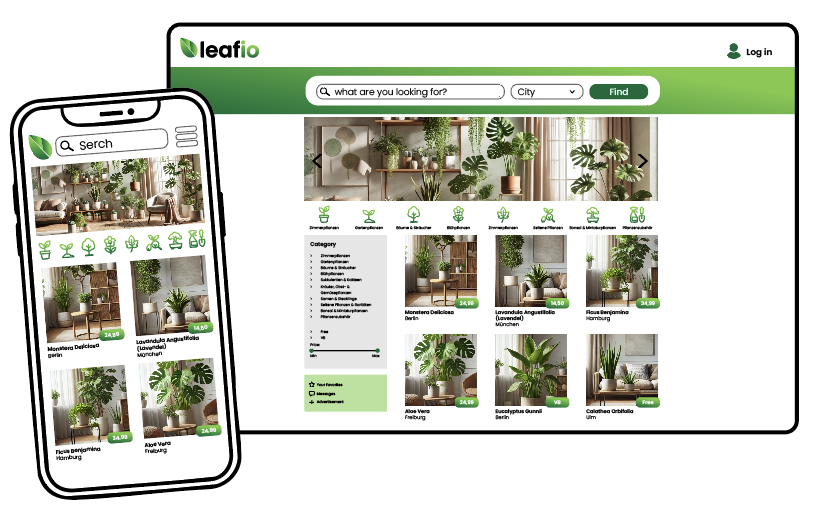

# 🌿 Leafio – Pflanzen teilen statt wegwerfen

Leafio ist ein Projekt im Rahmen des Web Development Kurses bei DCI (April/Mai 2025). Ziel der Anwendung ist es, eine benutzerfreundliche Webplattform zu entwickeln, auf der Privatpersonen ihre Pflanzen verschenken, verkaufen, tauschen oder weitergeben können – ganz lokal und nachhaltig.

Ob Ableger, Setzlinge oder Zimmerpflanzen: Leafio bringt Pflanzenfreunde zusammen und fördert den bewussten Umgang mit natürlichen Ressourcen.

### ✨ Features
- Pflanzenanzeigen erstellen & durchsuchen
- Filter nach Standort / Kategorie
- Kontaktaufnahme über integrierte Kommunikation (optional)
- Responsive Design für mobile & Desktop-Nutzung

### 🎯 Ziel

Leafio soll den nachhaltigen Umgang mit Pflanzen fördern und eine einfache Möglichkeit bieten, Pflanzen nicht wegzuwerfen, sondern weiterzugeben.

Dieses Projekt dient zugleich der praktischen Anwendung von im Kurs gelernten Webtechnologien (HTML, CSS, JavaScript, React, Node.js).

## Links

https://excalidraw.com/#room=704a7e2eedaac491a4dd,Y53Ynffv9YiQ6SSWkM22Sg

https://pads.ccc.de/sarahcalleben

